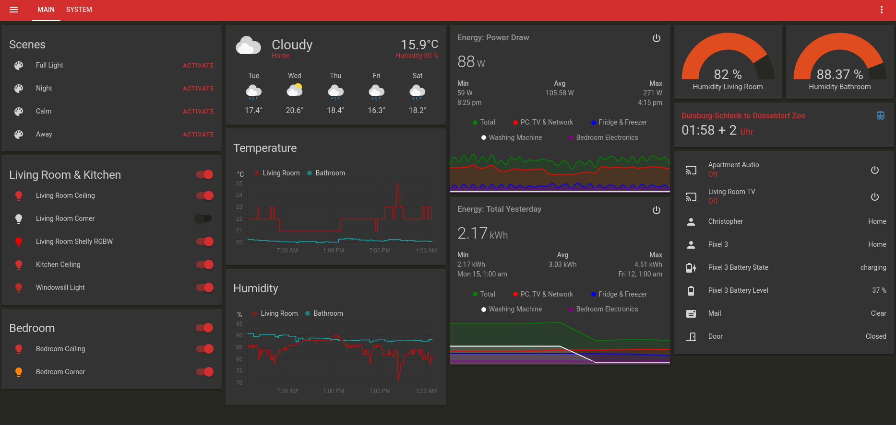

## restlessmodem's home-assistant
This repository contains the configuration files for my personal "home-assistant" smart-home system. It is running on a Raspberry Pi 3B+ and consist mostly out of TRÅDFRI (Zigbee) and tasmota devices. And yes, my humidity is way too high.

